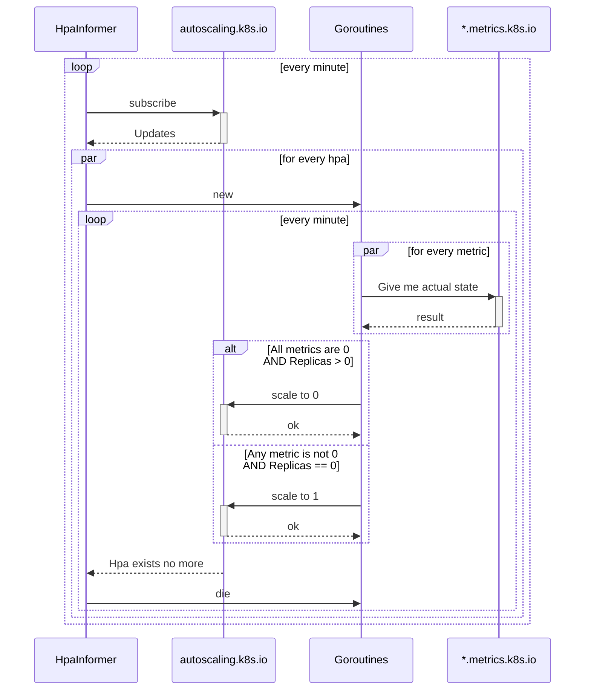

### Why
This service has been designed to be compatible with future autoscale-to-zero logic in kubernetes itself.
Until then - you have either use something like KEDA, or implement it by yourself

### K8s API requirements
- Autoscaling `v1`
- Meta `v1`
- External metrics `v1beta1`
- Custom metrics `v1beta1`

### Known Limitations
- Only `Object` and `External` metrics are supported
- Only `Deployment` is supported as HPA target
- Metric selector `MatchExpressions` is not supported

### Architecture overview


### Howto test locally
You can install demo services from the `./demo` folder
```
kubectl apply -f app.yml -n integration-demo
kubectl apply -f metric-generator.yml -n integration-demo
```
to have multiple deployments with multiple random metrics bouncing between 0 and 1

> **Note**\
> This example uses `spscommerce.com/scaleToZero: demo` instead of the real `spscommerce.com/scaleToZero: true`
> This will allow you to test your local version without affecting anything else

Now you can run service locally to scale services in a real kube cluster:
`go run ./cmd --kube-config "<path to your kube config>" --write-plain-logs --hpa-selector "spscommerce.com/scaleToZero: demo"`