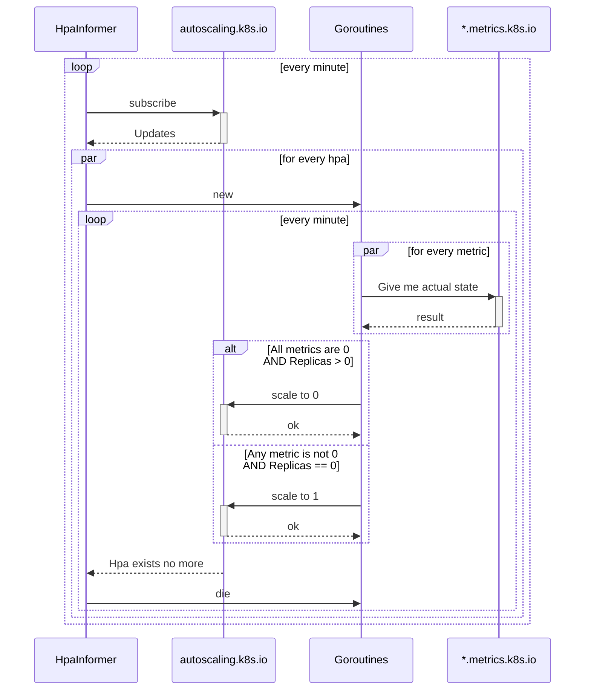

### Why
This service has been designed to be compatible with future autoscale-to-zero logic in kubernetes itself.
Until then - you have either use something like KEDA, or implement it by yourself

### Known Limitations
- Only `Object` and `External` metrics are supported
- Only `Deployment` is supported as HPA target
- Metric selector `MatchExpressions` is not supported
- HPA's `stabilizationWindow` is not being respected, scaling from/to 0 will be done asap 

### Architecture overview


### Available metrics
```
scale_to_zero_errors
scale_to_zero_events
scale_to_zero_panics
```

### Howto test locally
First you will need a testing cluster 
```
kind create cluster --config=./demo/kind-config.yaml
```

You have to install prometheus and prometheus-adapter
```
helm upgrade -i prometheus prometheus-community/kube-prometheus-stack
helm upgrade -i prom-adapter prometheus-community/prometheus-adapter -f ./demo/prom-adapter-values.yaml
```

Now install demo services from the `./demo` folder
```
kubectl apply -f ./demo/app.yml -n default
kubectl apply -f ./demo/metric-generator.yml -n default
```
to have multiple deployments with multiple random metrics bouncing between 0 and 1

Now you can run service locally to scale services in a real kube cluster:
`go run ./cmd --kube-config "<path to your kube config>" --hpa-selector "scaleToZero.spscommerce.com/watch=true"`